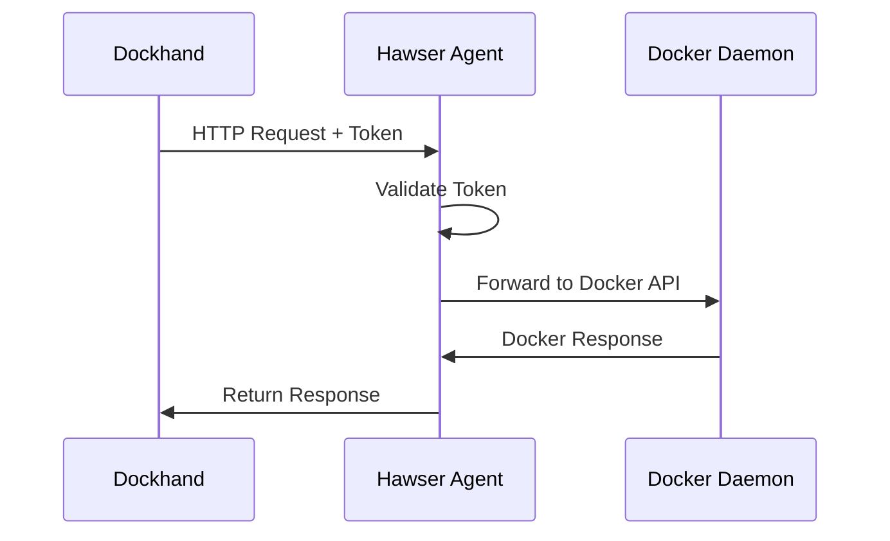
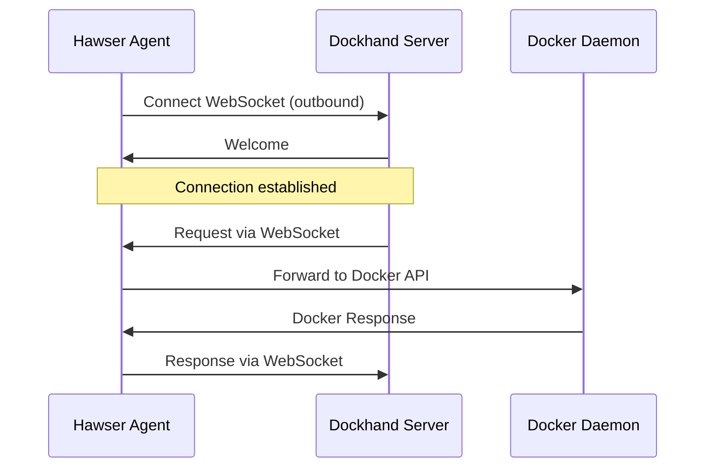

Hawser is Dockhand's lightweight agent that enables secure connections to Docker hosts in edge locations, behind NAT, or within private networks. It establishes outbound WebSocket connections to your Dockhand server, eliminating the need for port forwarding or VPN configuration.

## Overview

Hawser provides two connection modes:

<CardGroup cols={2}>
  <Card title="Standard Mode" icon="link">
    Direct HTTP/HTTPS connection with token authentication. Use for hosts accessible via direct TCP.
  </Card>
  <Card title="Edge Mode" icon="cloud">
    WebSocket-based connection for NAT traversal. Perfect for edge devices, home labs, and private networks.
  </Card>
</CardGroup>

## Architecture

### Standard Mode

In Standard mode, Hawser acts as a reverse proxy, forwarding authenticated requests to the local Docker daemon.



### Edge Mode

In Edge mode, Hawser establishes an outbound WebSocket connection, enabling bidirectional communication without inbound ports.



## Installation

Hawser is distributed as a single binary for Linux, macOS, and Windows.

<Tabs>
  <Tab title="Docker">
    Run Hawser as a container:
    
    ```bash
    docker run -d \
      --name hawser \
      --restart unless-stopped \
      -v /var/run/docker.sock:/var/run/docker.sock \
      -e DOCKHAND_SERVER_URL=https://dockhand.example.com \
      -e DOCKHAND_TOKEN=your-token-here \
      ghcr.io/dockhand/hawser:latest
    ```
  </Tab>
  
  <Tab title="Linux">
    Download and install the binary:
    
    ```bash
    # Download latest release
    curl -fsSL https://github.com/dockhand/hawser/releases/latest/download/hawser-linux-amd64 -o hawser
    chmod +x hawser
    sudo mv hawser /usr/local/bin/
    
    # Create systemd service
    sudo tee /etc/systemd/system/hawser.service > /dev/null <<EOF
    [Unit]
    Description=Hawser Edge Agent
    After=network.target docker.service
    Requires=docker.service
    
    [Service]
    Type=simple
    Environment="DOCKHAND_SERVER_URL=https://dockhand.example.com"
    Environment="DOCKHAND_TOKEN=your-token-here"
    ExecStart=/usr/local/bin/hawser
    Restart=always
    RestartSec=10
    
    [Install]
    WantedBy=multi-user.target
    EOF
    
    # Start the service
    sudo systemctl daemon-reload
    sudo systemctl enable hawser
    sudo systemctl start hawser
    ```
  </Tab>
  
  <Tab title="macOS">
    Download and install:
    
    ```bash
    # Download latest release
    curl -fsSL https://github.com/dockhand/hawser/releases/latest/download/hawser-darwin-amd64 -o hawser
    chmod +x hawser
    sudo mv hawser /usr/local/bin/
    
    # Run with environment variables
    export DOCKHAND_SERVER_URL=https://dockhand.example.com
    export DOCKHAND_TOKEN=your-token-here
    hawser
    ```
  </Tab>
  
  <Tab title="Windows">
    Download from GitHub releases and run:
    
    ```powershell
    # Set environment variables
    $env:DOCKHAND_SERVER_URL="https://dockhand.example.com"
    $env:DOCKHAND_TOKEN="your-token-here"
    
    # Run Hawser
    .\hawser.exe
    ```
  </Tab>
</Tabs>

## Configuration

### Generating Tokens

<Steps>
  <Step title="Create environment">
    In Dockhand, navigate to **Settings** > **Environments** and create a new environment.
  </Step>
  
  <Step title="Select Hawser mode">
    Choose connection type:
    - **Hawser Standard**: For direct HTTP access
    - **Hawser Edge**: For WebSocket connections (recommended)
  </Step>
  
  <Step title="Generate token">
    Click **Generate Token**. The token will only be shown once, so save it securely.
  </Step>
  
  <Step title="Configure agent">
    Set the token on your Hawser agent:
    
    ```bash
    export DOCKHAND_TOKEN=dh_xxxxxxxxxxxxxxxxx
    ```
  </Step>
</Steps>

### Environment Variables

```bash
# Required
DOCKHAND_SERVER_URL=https://dockhand.example.com  # Dockhand server URL
DOCKHAND_TOKEN=dh_xxxxxxxxxx                     # Authentication token

# Optional
DOCKER_HOST=unix:///var/run/docker.sock          # Docker socket path
HAWSER_MODE=edge                                  # 'standard' or 'edge' (default: edge)
HAWSER_PORT=8080                                  # Port for standard mode (default: 8080)
HAWSER_AGENT_NAME=production-01                   # Custom agent name
LOG_LEVEL=info                                    # Logging level (debug|info|warn|error)
```

### Standard Mode Configuration

For Standard mode, configure the agent to listen on a port:

```bash
export HAWSER_MODE=standard
export HAWSER_PORT=8080
export DOCKHAND_TOKEN=dh_xxxxxxxxxx
hawser
```

Then configure the environment in Dockhand:

```yaml
Name: Remote Server
Connection Type: Hawser Standard
Host: hawser.example.com
Port: 8080
Protocol: https
Token: (configured automatically)
```

## WebSocket Protocol

Hawser Edge uses a JSON-based WebSocket protocol for bidirectional communication.

### Message Types

<AccordionGroup>
  <Accordion title="hello" icon="handshake">
    Sent by agent on connection:
    
    ```json
    {
      "type": "hello",
      "version": "1.0",
      "agentId": "uuid",
      "agentName": "production-01",
      "token": "dh_xxxxxxxxxx",
      "dockerVersion": "24.0.7",
      "hostname": "docker-host",
      "capabilities": ["compose", "exec", "metrics"]
    }
    ```
  </Accordion>
  
  <Accordion title="welcome" icon="check">
    Sent by server after authentication:
    
    ```json
    {
      "type": "welcome",
      "environmentId": 1,
      "serverId": "dockhand",
      "version": "1.0"
    }
    ```
  </Accordion>
  
  <Accordion title="request" icon="arrow-right">
    Docker API request from server:
    
    ```json
    {
      "type": "request",
      "requestId": "uuid",
      "method": "GET",
      "path": "/containers/json",
      "headers": {},
      "body": null,
      "streaming": false
    }
    ```
  </Accordion>
  
  <Accordion title="response" icon="arrow-left">
    Response from agent:
    
    ```json
    {
      "type": "response",
      "requestId": "uuid",
      "statusCode": 200,
      "headers": {"Content-Type": "application/json"},
      "body": "[...]",
      "isBinary": false
    }
    ```
  </Accordion>
  
  <Accordion title="metrics" icon="chart-line">
    System metrics from agent:
    
    ```json
    {
      "type": "metrics",
      "timestamp": 1234567890,
      "metrics": {
        "cpuUsage": 45.2,
        "cpuCores": 8,
        "memoryTotal": 16000000000,
        "memoryUsed": 8000000000,
        "uptime": 3600
      }
    }
    ```
  </Accordion>
  
  <Accordion title="ping/pong" icon="signal">
    Heartbeat messages:
    
    ```json
    {"type": "ping", "timestamp": 1234567890}
    {"type": "pong", "timestamp": 1234567890}
    ```
  </Accordion>
</AccordionGroup>

## Features

### Automatic Reconnection

Hawser automatically reconnects to the Dockhand server if the connection is lost. It uses exponential backoff to avoid overwhelming the server:

- Initial retry: 1 second
- Maximum retry interval: 60 seconds
- Backoff multiplier: 2x

### Container Event Forwarding

Hawser monitors Docker events and forwards them to Dockhand in real-time:

```json
{
  "type": "container_event",
  "event": {
    "containerId": "abc123",
    "containerName": "nginx",
    "image": "nginx:latest",
    "action": "start",
    "timestamp": "2024-03-04T12:00:00Z"
  }
}
```

### Metrics Collection

Hawser collects and reports host metrics every 30 seconds:

- CPU usage (per core and total)
- Memory usage (used/total)
- Disk usage
- Network I/O
- Uptime

### Docker Compose Support

Hawser supports Docker Compose operations through a special endpoint:

```bash
POST /_hawser/compose
{
  "command": "up",
  "composeFile": "version: '3.8'\nservices:\n  app:\n    image: nginx",
  "envFile": "KEY=value",
  "project": "myapp"
}
```

## Monitoring

### Connection Status

View active Hawser connections in Dockhand:

1. Navigate to **Settings** > **Environments**
2. Check the **Status** column for connected agents
3. Click **View Details** to see:
   - Agent version
   - Docker version
   - Last seen timestamp
   - Uptime
   - Capabilities

### Health Check Endpoint

In Standard mode, Hawser exposes a health check endpoint:

```bash
curl http://localhost:8080/health
```

Response:

```json
{
  "status": "healthy",
  "docker": "connected",
  "version": "1.0.0"
}
```

## Troubleshooting

<AccordionGroup>
  <Accordion title="Agent won't connect">
    - Verify `DOCKHAND_SERVER_URL` is correct and reachable
    - Check token is valid and not expired
    - Ensure firewall allows outbound WebSocket connections (port 443 for HTTPS)
    - Review agent logs: `journalctl -u hawser -f`
    - Test connectivity: `curl https://dockhand.example.com/api/hawser/connect`
  </Accordion>
  
  <Accordion title="Connection keeps dropping">
    - Check network stability between agent and server
    - Verify no proxy or load balancer is terminating WebSocket connections
    - Increase WebSocket timeout on reverse proxy if applicable
    - Review server logs for error messages
  </Accordion>
  
  <Accordion title="Docker commands fail">
    - Verify Docker socket path is correct (`DOCKER_HOST`)
    - Ensure Hawser has permission to access Docker socket
    - For containers, mount socket: `-v /var/run/docker.sock:/var/run/docker.sock`
    - Check Docker daemon is running: `docker ps`
  </Accordion>
  
  <Accordion title="Metrics not appearing">
    - Verify agent capabilities include "metrics"
    - Check agent logs for metric collection errors
    - Ensure agent has permission to read system metrics
    - Metrics are reported every 30 seconds, wait for next interval
  </Accordion>
</AccordionGroup>

## Security Considerations

<Warning>
  Hawser tokens provide full access to the Docker daemon. Treat them like root passwords.
</Warning>

1. **Token rotation**: Regenerate tokens periodically (every 90 days)
2. **Network security**: Use HTTPS for server URL (enforces TLS for WebSocket)
3. **Access control**: Create separate environments/tokens for different hosts
4. **Monitoring**: Enable audit logging to track all Docker API calls
5. **Minimal privileges**: Run Hawser with minimal required permissions

## Advanced Configuration

### Custom Docker Socket

For non-standard Docker installations:

```bash
export DOCKER_HOST=tcp://localhost:2375
# or
export DOCKER_HOST=unix:///custom/path/docker.sock
```

### Behind Corporate Proxy

Configure HTTP proxy for WebSocket connections:

```bash
export HTTP_PROXY=http://proxy.example.com:8080
export HTTPS_PROXY=http://proxy.example.com:8080
export NO_PROXY=localhost,127.0.0.1
```

### Custom CA Certificates

For self-signed certificates:

```bash
export SSL_CERT_FILE=/path/to/ca-bundle.crt
# or
export SSL_CERT_DIR=/path/to/certs/
```

## API Reference

For detailed API information, see:

- **Token Management**: `/api/hawser/tokens`
- **Connection Status**: `/api/hawser/connect`
- **WebSocket Endpoint**: `wss://your-server/api/hawser/connect`

See the [API Reference](/api/overview) for full documentation.

## Next Steps

<CardGroup cols={2}>
  <Card title="Remote Hosts" icon="server" href="/integrations/remote-hosts">
    Configure direct TLS connections
  </Card>
  <Card title="Webhooks" icon="webhook" href="/integrations/webhooks">
    Set up Git webhooks for automatic deployments
  </Card>
</CardGroup>