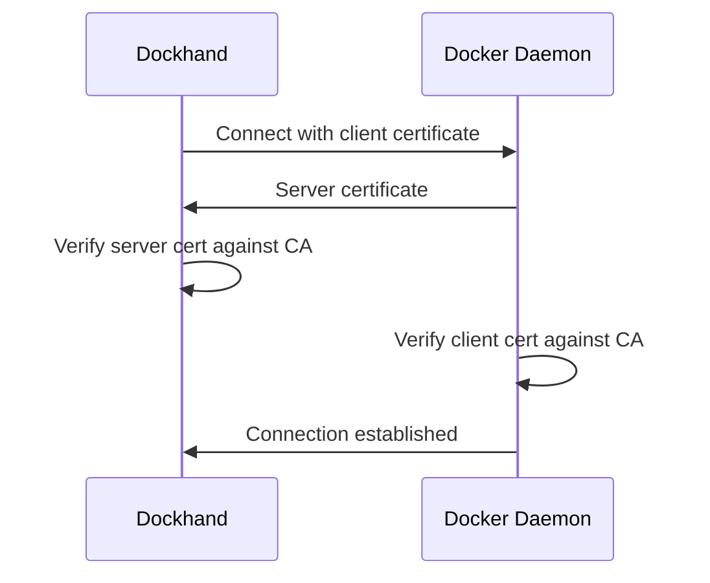

Dockhand can connect to Docker hosts on remote servers using multiple secure connection methods. Whether you need basic TLS encryption, mutual TLS authentication, or SSH tunneling, Dockhand provides flexible options for secure remote Docker management.

## Connection Types

Dockhand supports four connection methods for Docker environments:

<CardGroup cols={2}>
  <Card title="Unix Socket" icon="plug">
    Local connection via Docker socket (default for local setups)
  </Card>
  <Card title="Direct TCP" icon="link">
    Direct HTTP/HTTPS connection to remote Docker daemon
  </Card>
  <Card title="Hawser Standard" icon="tower-broadcast">
    HTTP connection with token authentication via Hawser agent
  </Card>
  <Card title="Hawser Edge" icon="cloud">
    WebSocket connection for NAT traversal and edge deployments
  </Card>
</CardGroup>

## Direct TCP Connection

Connect directly to a remote Docker daemon over HTTP or HTTPS.

### Basic Configuration

1. Navigate to **Settings** > **Environments**
2. Click **Add Environment**
3. Select connection type: **Direct**
4. Configure the connection:

```yaml Connection Settings
Name: Production Server
Host: docker.example.com
Port: 2376
Protocol: https
```

### TLS Configuration

Secure your connection with TLS encryption. The Docker daemon must be configured to expose its API over TLS.

<Steps>
  <Step title="Configure Docker daemon">
    On your remote server, edit `/etc/docker/daemon.json`:
    
    ```json /etc/docker/daemon.json
    {
      "hosts": ["unix:///var/run/docker.sock", "tcp://0.0.0.0:2376"],
      "tls": true,
      "tlscacert": "/etc/docker/certs/ca.pem",
      "tlscert": "/etc/docker/certs/server-cert.pem",
      "tlskey": "/etc/docker/certs/server-key.pem",
      "tlsverify": true
    }
    ```
  </Step>
  
  <Step title="Generate certificates">
    Generate TLS certificates for the Docker daemon:
    
    ```bash
    # Generate CA
    openssl genrsa -aes256 -out ca-key.pem 4096
    openssl req -new -x509 -days 365 -key ca-key.pem -sha256 -out ca.pem
    
    # Generate server certificate
    openssl genrsa -out server-key.pem 4096
    openssl req -subj "/CN=docker.example.com" -sha256 -new -key server-key.pem -out server.csr
    openssl x509 -req -days 365 -sha256 -in server.csr -CA ca.pem -CAkey ca-key.pem -CAcreateserial -out server-cert.pem
    
    # Generate client certificate
    openssl genrsa -out key.pem 4096
    openssl req -subj '/CN=client' -new -key key.pem -out client.csr
    openssl x509 -req -days 365 -sha256 -in client.csr -CA ca.pem -CAkey ca-key.pem -CAcreateserial -out cert.pem
    ```
  </Step>
  
  <Step title="Add certificates to Dockhand">
    In the environment configuration, paste your certificates:
    
    - **TLS CA Certificate**: Contents of `ca.pem`
    - **TLS Client Certificate**: Contents of `cert.pem`
    - **TLS Client Key**: Contents of `key.pem`
  </Step>
</Steps>

<Note>
  **Skip TLS verification** option is available for testing with self-signed certificates, but not recommended for production.
</Note>

## Mutual TLS (mTLS)

For maximum security, use mutual TLS authentication where both client and server verify each other's certificates.

### Configuration

1. Follow the TLS configuration steps above
2. Ensure `tlsverify: true` in the Docker daemon configuration
3. Provide all three certificates in Dockhand:
   - CA certificate (to verify server)
   - Client certificate (for client authentication)
   - Client key (matching the client certificate)

### How mTLS Works



## SSH Tunnel Connection

While Dockhand doesn't have built-in SSH tunneling, you can establish an SSH tunnel separately and connect Dockhand through it.

### Setup SSH Tunnel

<Steps>
  <Step title="Create SSH tunnel">
    On your Dockhand host, create an SSH tunnel to forward the Docker port:
    
    ```bash
    ssh -L 2376:localhost:2376 user@docker.example.com -N -f
    ```
    
    This forwards local port 2376 to the remote Docker daemon.
  </Step>
  
  <Step title="Configure Dockhand">
    Add the environment pointing to localhost:
    
    ```yaml
    Name: Remote via SSH
    Host: localhost
    Port: 2376
    Protocol: http
    ```
  </Step>
  
  <Step title="Make tunnel persistent">
    Use systemd or autossh to keep the tunnel running:
    
    ```systemd /etc/systemd/system/docker-tunnel.service
    [Unit]
    Description=SSH Tunnel to Docker
    After=network.target
    
    [Service]
    ExecStart=/usr/bin/ssh -L 2376:localhost:2376 user@docker.example.com -N
    Restart=always
    RestartSec=10
    
    [Install]
    WantedBy=multi-user.target
    ```
  </Step>
</Steps>

<Tip>
  For production deployments, consider using [Hawser Edge mode](/integrations/hawser) instead of SSH tunnels for easier NAT traversal and automatic reconnection.
</Tip>

## Connection Schema

The environment configuration uses the following schema:

```typescript
interface Environment {
  id: number;
  name: string;
  host?: string;
  port?: number;              // Default: 2375 (HTTP) or 2376 (HTTPS)
  protocol?: 'http' | 'https'; // Default: 'http'
  
  // TLS configuration
  tlsCa?: string;             // CA certificate for server verification
  tlsCert?: string;           // Client certificate for mTLS
  tlsKey?: string;            // Client private key for mTLS
  tlsSkipVerify?: boolean;    // Skip certificate verification (not recommended)
  
  // Connection type
  connectionType: 'socket' | 'direct' | 'hawser-standard' | 'hawser-edge';
  socketPath?: string;        // For 'socket' type, default: /var/run/docker.sock
  
  // Hawser configuration
  hawserToken?: string;       // Authentication token for Hawser modes
}
```

## Troubleshooting

<AccordionGroup>
  <Accordion title="Connection timeout">
    - Verify the host and port are correct
    - Check firewall rules allow traffic on the Docker port
    - Ensure Docker daemon is configured to accept remote connections
    - Test connectivity with: `curl https://docker.example.com:2376/_ping`
  </Accordion>
  
  <Accordion title="TLS certificate errors">
    - Ensure certificates are in PEM format
    - Verify the CA certificate matches the server certificate
    - Check certificate dates (not expired)
    - Confirm the CN/SAN in server certificate matches the hostname
    - Enable **Skip TLS Verification** temporarily to isolate the issue
  </Accordion>
  
  <Accordion title="Authentication failed">
    - For mTLS, verify all three certificates are provided
    - Ensure the client certificate is signed by the same CA
    - Check Docker daemon has `tlsverify: true` for mTLS
    - Review Docker daemon logs for authentication errors
  </Accordion>
  
  <Accordion title="Connection refused">
    - Verify Docker daemon is listening on the configured port:
      ```bash
      netstat -tlnp | grep 2376
      ```
    - Check Docker daemon configuration in `/etc/docker/daemon.json`
    - Restart Docker daemon after configuration changes:
      ```bash
      systemctl restart docker
      ```
  </Accordion>
</AccordionGroup>

## Security Best Practices

<Warning>
  Never expose Docker daemon ports directly to the internet without TLS/mTLS authentication.
</Warning>

1. **Always use TLS** for remote connections
2. **Enable mTLS** for production environments
3. **Rotate certificates** regularly (every 90 days)
4. **Use firewall rules** to restrict access to Docker ports
5. **Monitor connection logs** for unauthorized access attempts
6. **Consider Hawser Edge** for zero-trust deployments behind NAT

## Next Steps

<CardGroup cols={2}>
  <Card title="Hawser Agent" icon="tower-broadcast" href="/integrations/hawser">
    Deploy Hawser for secure edge connectivity
  </Card>
  <Card title="Container Registries" icon="box" href="/integrations/registries">
    Configure private container registries
  </Card>
</CardGroup>